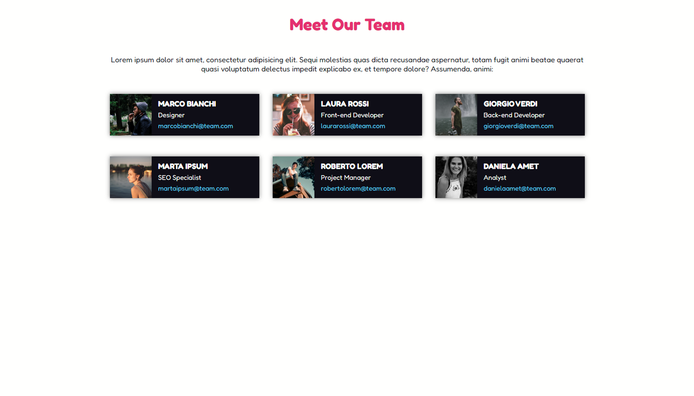

# Ricreare un layout

> Esercizio Floating Cards

## Ricreiamo una TodoList seguendo il layout in allegato.

- Descrizione

  Riproduzione di un micro layout contenente 6 cards di un ipotetico team.
  Partiamo dal realizzare la struttura base della nostra sezione solo con i blocchi colorati per definire struttura e dimensioni di colonne e cards. Una volta definita la struttura inserire testi, immagini etc. e pensare al dettaglio.

## Tecnologie

- HTML
- CSS
- Git e Github

## Contatti

francescodicorpo30@gmail.com
